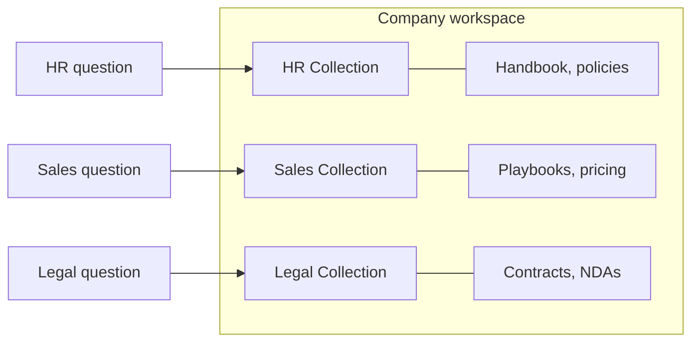

# DeptQ

**DeptQ** — *Dept* (department) + *Q* (question): **Q&A for every department.** A RAG-powered PDF chatbot: upload PDFs, organize them into collections — a separate knowledge base per team or department — and chat with them in natural language, with cited answers and persistent history. Built with Next.js 15, assistant-ui, AI SDK v7, DeepSeek, Gemini embeddings, and pgvector.

## 🎯 What is This Project?

**DeptQ** is a document-intelligence app that turns PDF documents into a searchable, conversational knowledge base:

- Upload PDFs and have their text extracted page-by-page and chunked
- Embed chunks with Google Gemini (`gemini-embedding-001`, 3072-dim) and index them in PostgreSQL with pgvector
- Organize documents into **collections** — one knowledge base per team or department; chats scoped to a collection search only that collection's documents (or chat across all of them)
- Ask questions and get streamed answers with `[N]` inline citations plus a sources panel (filename, page, snippet, relevance score)
- Keep persistent chat history per user, with a full-page chat view and a floating chat widget

## 📸 Screenshots

### Home Page


### Knowledge Management


### PDF Upload Interface


### Chat Conversation


### Chat with Document Sources


## ✨ Key Features

- 🔐 **Email & Password Auth** — better-auth with 30-day sessions; dashboard and API routes protected by middleware
- 📄 **PDF Upload & Processing** — drag-and-drop upload, per-page text extraction via `pdf-parse`, chunking (~1000 chars, 200 overlap)
- 🗂️ **Collections as Departmental Knowledge Bases** — a separate collection per team (HR, Sales, Legal, Engineering…); each has its own documents, and chats scoped to it search only within that collection
- 💬 **RAG Chat** — DeepSeek (`deepseek-chat`) answers streamed via AI SDK v7 with semantic retrieval from pgvector
- 🔍 **Semantic Vector Search** — Gemini `gemini-embedding-001` embeddings (3072-dim) with cosine similarity search
- 📎 **Source Attribution** — `[N]` inline citations plus a sources panel with filename, page, snippet, and score
- 🧰 **Tool Calling** — `countDocuments`, `listDocuments`, and `getDocumentContent` tools for exact library queries
- 💾 **Persistent Chat History** — chats and messages stored in PostgreSQL via Prisma
- 🪟 **Dual Chat Surfaces** — full-page chat and a floating widget (assistant-ui), synced via Zustand
- 🎨 **Modern UI** — Tailwind CSS 4, shadcn/ui (Radix), lucide icons, streaming responses

## 🏢 Use Case: One Knowledge Base per Department

Collections were designed for organizations that need to keep knowledge separate. In a small business, create one collection per department:

| Collection | Example documents | Chats answer |
| ---------- | ----------------- | ------------ |
| HR | Employee handbook, policies, benefits guides | HR questions only |
| Sales | Price lists, playbooks, battle cards | Sales questions only |
| Legal | Contracts, compliance documents, NDAs | Legal questions only |
| Engineering | Specs, postmortems, runbooks | Engineering questions only |

- A chat started from a collection searches **only** that collection's documents — no cross-department leakage.
- A chat started from the home page searches all of your documents, for company-wide questions.
- Every answer still comes with page-level `[N]` citations, so responses stay auditable.



## 🛠️ Technology Stack

| Layer | Technology |
| ----- | ---------- |
| Framework | Next.js 15 (App Router), React 19, TypeScript |
| Chat UI | assistant-ui (`@assistant-ui/react`), AI SDK v7 (`@ai-sdk/react`) |
| LLM | DeepSeek `deepseek-chat` via `@ai-sdk/deepseek` |
| Embeddings | Google Gemini `gemini-embedding-001` (3072-dim) via `@ai-sdk/google` |
| Database | PostgreSQL 13+ with pgvector, Prisma 6 ORM |
| Auth | better-auth (email & password, DB sessions) |
| PDF Parsing | `pdf-parse` (per-page text extraction) |
| UI | Tailwind CSS 4, shadcn/ui (Radix), lucide-react, sonner |
| State | Zustand (cross-surface chat store) |
| Deployment | Vercel-ready (`vercel.json` build command) |

## 🚀 Getting Started

### Prerequisites

- **Node.js 18.18+** (Next.js 15 requirement)
- **npm** (or another package manager)
- **PostgreSQL 13+ with the pgvector extension** (local or cloud)
- API keys for **DeepSeek** (chat) and **Google Gemini** (embeddings)

### Quick Start

#### 1. Install dependencies

```bash
npm install
```

> `postinstall` automatically runs `prisma generate`.

#### 2. Configure environment variables

```bash
cp .env.example .env
```

| Variable | Description |
| -------- | ----------- |
| `DATABASE_URL` | PostgreSQL connection string (Prisma; pooled ok) |
| `DIRECT_URL` | Direct (non-pooled) connection string, used for migrations |
| `GOOGLE_GENERATIVE_AI_API_KEY` | Google Gemini API key for `gemini-embedding-001` embeddings |
| `DEEPSEEK_API_KEY` | DeepSeek API key for `deepseek-chat` responses |
| `BETTER_AUTH_SECRET` | Secret for signing auth sessions (any long random string) |

#### 3. Set up the database

```bash
npx prisma migrate dev
```

The migration creates the `vector` extension and all tables.

#### 4. Start the dev server

```bash
npm run dev
```

Open [http://localhost:3000](http://localhost:3000), create an account, and upload a PDF.

## 📋 Detailed Setup Instructions

### Getting API Keys

1. **DeepSeek API key**:
   - Visit [platform.deepseek.com](https://platform.deepseek.com/) and create an API key
   - Set `DEEPSEEK_API_KEY` in `.env`

2. **Google Gemini API key** (for embeddings):
   - Visit [Google AI Studio](https://aistudio.google.com/) and create an API key
   - Set `GOOGLE_GENERATIVE_AI_API_KEY` in `.env`

### Database Configuration

#### Option 1: Local PostgreSQL with pgvector

```bash
# macOS
brew install postgresql@17 pgvector
brew services start postgresql@17
createdb deptq
```

Then point `.env` at it:

```bash
DATABASE_URL="postgresql://<your-username>@localhost:5432/deptq"
DIRECT_URL="postgresql://<your-username>@localhost:5432/deptq"
```

`npx prisma migrate dev` creates the `vector` extension automatically.

#### Option 2: Cloud PostgreSQL (recommended for deployment)

**Neon** (free tier, pgvector built in):

1. Create a project at [console.neon.tech](https://console.neon.tech/)
2. Copy the pooled connection string into `DATABASE_URL`
3. Copy the direct/unpooled connection string into `DIRECT_URL`
4. Run `npx prisma migrate dev`

Other options that support pgvector: Vercel Postgres, Supabase, RDS, or any PostgreSQL 13+ server with the extension installed.

## 📖 How to Use

1. **Create an account** — register at `/register`, then sign in at `/login`.
2. **Upload PDFs** — on the Documents page, drag and drop PDFs. They are extracted page-by-page, chunked, embedded, and indexed automatically.
3. **Create collections** — on the Collections page, create a collection per team or department (e.g. HR, Sales, Legal) and add the relevant documents to each.
4. **Chat with your documents**:
   - Use the full-page chat (home page or `/chat/[id]`) for an in-depth conversation.
   - Use the floating chat widget (bottom-right) from anywhere in the dashboard — both share the same thread list.
   - Type a question in a collection's "Ask this collection" box to start a chat scoped to that collection; a chat started from the home page searches all of your documents.
5. **Read the sources** — every answer shows `[N]` citations; the sources panel lists the filename, page, snippet, and relevance score for each cited chunk.
6. **Pick up where you left off** — chat history is persisted, and previous conversations can be reopened from the sidebar thread list.

## 🔧 Database Management

The application uses PostgreSQL with Prisma ORM and pgvector for data persistence.

```bash
npm run db:generate # Generate Prisma client after schema changes
npm run db:push     # Push schema changes directly to the database
npm run db:studio   # Browse and edit data in Prisma Studio
npm run db:reset    # Force-reset the database (⚠️ deletes all data)
```

## 📚 Available Scripts

```bash
npm run dev          # Start the dev server (Next.js + Turbopack)
npm run build        # Generate Prisma client + production build
npm run start        # Start the production server
npm run lint         # Run ESLint
npm run db:generate  # Generate Prisma client
npm run db:push      # Push schema changes to the database
npm run db:studio    # Open Prisma Studio
npm run db:reset     # Force-reset the database
```

## 🌐 API Endpoints

All endpoints except `/api/auth/*` require a valid session cookie.

### Auth
- `GET|POST /api/auth/[...all]` — better-auth handler

### Chat
- `GET /api/chat?chatId=...` — get chat messages
- `POST /api/chat` — send a message; streams the AI response (returns `X-Chat-Id`)
- `GET|POST /api/chats` — list / create chats
- `GET|PUT|DELETE /api/chats/[id]` — get / update / delete a chat

### Documents
- `GET|POST /api/documents` — list / create documents
- `DELETE /api/documents/[id]` — delete a document and its chunks
- `POST /api/upload` — upload and process PDF documents

### Collections
- `GET|POST /api/collections` — list / create collections
- `GET|PUT|DELETE /api/collections/[id]` — get / update / delete a collection
- `POST /api/collections/[id]/documents` — add documents to a collection
- `DELETE /api/collections/[id]/documents/[documentId]` — remove a document from a collection

## 📁 Project Structure

```
rag-pdf-chatbot/
├── prisma/
│   ├── schema.prisma                  # Prisma schema (pgvector extension)
│   └── migrations/                    # SQL migrations
├── src/
│   ├── app/
│   │   ├── page.tsx                   # Landing page / chat home (authenticated)
│   │   ├── (auth)/
│   │   │   ├── login/page.tsx
│   │   │   └── register/page.tsx
│   │   ├── (dashboard)/
│   │   │   ├── layout.tsx             # Auth guard + sidebar + floating chat
│   │   │   ├── chat/[id]/page.tsx     # Full-page chat
│   │   │   ├── collections/page.tsx
│   │   │   ├── collections/[id]/page.tsx
│   │   │   └── documents/page.tsx     # Upload + document list
│   │   └── api/
│   │       ├── auth/[...all]/route.ts # better-auth handler
│   │       ├── chat/route.ts          # RAG chat (streaming)
│   │       ├── chats/                 # Chat CRUD
│   │       ├── documents/             # Document CRUD
│   │       ├── collections/           # Collection CRUD
│   │       └── upload/route.ts        # PDF upload
│   ├── components/
│   │   ├── assistant-ui/              # Thread, thread list, markdown, tool UI
│   │   ├── auth/                      # Auth guard, interceptor, login form
│   │   ├── chat/                      # Chat home, chat page, floating widget
│   │   ├── collections/               # Collection cards
│   │   ├── documents/                 # Upload zone, document list
│   │   ├── layout/                    # App sidebar
│   │   └── ui/                        # shadcn/ui components
│   ├── hooks/use-chat-store.ts        # Zustand hook
│   ├── lib/
│   │   ├── auth.ts                    # better-auth client
│   │   ├── auth-server.ts             # better-auth server config
│   │   ├── db.ts                      # Prisma client singleton
│   │   ├── document-processor.ts      # PDF parsing + chunking
│   │   ├── document-tools.ts          # AI tools (count/list/get content)
│   │   ├── retrieval.ts               # Vector search + context formatting
│   │   └── vector-service.ts          # pgvector operations
│   ├── store/chat-store.ts            # Zustand store (thread sync)
│   └── types/index.ts                 # Shared types
├── middleware.ts                       # Route protection
├── vercel.json                         # Vercel build config
└── package.json
```

## 🔍 How It Works

### Document processing

```
PDF upload → per-page text extraction (pdf-parse) → chunking (~1000 chars, 200 overlap)
→ Gemini embedding (gemini-embedding-001, 3072-dim) → pgvector storage (DocumentChunk)
```

### Chat and retrieval

```
Question → Gemini query embedding → pgvector cosine similarity search (top 8, score ≥ 0.35)
→ DeepSeek deepseek-chat with retrieved context + document tools → streamed reply with [N] citations
```

- Chats scoped to a collection restrict retrieval to that collection's documents; global chats search all completed documents.
- The model can call `countDocuments`, `listDocuments`, and `getDocumentContent` for exact library queries.
- Responses and sources are persisted to `Message` rows when the stream completes.

## 🚀 Deployment

### Deploy to Vercel

1. Push this repository to GitHub and import it in Vercel.
2. Configure the environment variables in the Vercel project (see the table above):
   - `DATABASE_URL` (pooled) and `DIRECT_URL` (direct) — e.g. from Neon
   - `GOOGLE_GENERATIVE_AI_API_KEY`, `DEEPSEEK_API_KEY`, `BETTER_AUTH_SECRET`
3. Run migrations against the production database:
   ```bash
   npx prisma migrate deploy
   ```
4. Deploy — `vercel.json` already sets the build command to `npx prisma generate && next build`.

### Other Platforms

Any Node.js host that supports Next.js works (Railway, Render, Fly.io, Docker), as long as PostgreSQL with pgvector is reachable.

## 🔧 Customization

### Changing the chat model
Edit `src/app/api/chat/route.ts` — swap `deepseek("deepseek-chat")` for another AI SDK provider (e.g. `openai` or `google`).

### Changing the embedding model
Edit `src/lib/vector-service.ts` — the embedding model is defined at the top of the file (`EMBEDDING_MODEL`). Changing the dimension also requires updating `embedding Unsupported("vector(3072)")` in `prisma/schema.prisma`.

### Supporting more file types
Extend `src/lib/document-processor.ts` (currently PDF-only via `pdf-parse`).

### UI customization
- Tailwind v4 theme is configured in CSS — see `src/app/globals.css`
- shadcn/ui components live in `src/components/ui/`

## 🐛 Troubleshooting

### Common Issues

1. **`Can't reach database server`** — check `DATABASE_URL`/`DIRECT_URL` and that PostgreSQL is running.
2. **`type "vector" does not exist`** — install/enable pgvector (`CREATE EXTENSION vector;`) and re-run `npx prisma migrate dev`.
3. **`401 Unauthorized`** — the better-auth session is missing; sign in again or clear the `better-auth.session_token` cookie.
4. **Chat responds without citations** — no chunks passed the similarity threshold; try a more specific question or check the document finished processing (`status: completed`).
5. **Embedding errors** — verify `GOOGLE_GENERATIVE_AI_API_KEY` and that `gemini-embedding-001` is enabled for the key.
6. **Prisma client mismatch** — run `npx prisma generate`.

## 📈 Roadmap

**Current phase** — team collaboration MVP (spec: `.scratch/deptq-team-collab-mvp/spec.md`, tickets: `.scratch/deptq-team-collab-mvp/issues/`):

- [ ] **Collection Sharing** — invite links, owner/member roles, member management, Owner/Member badges
- [ ] **Hardening** — 20 MB upload cap, per-user rate limits on chat and upload

**Planned next**:

- [ ] **More File Types** — Markdown, TXT, DOCX support
- [ ] **Organization Workspace** — org-level users, admin role, shared department document libraries
- [ ] **Shared Chat History** — department-wide conversation threads

**Later**:

- [ ] **Advanced Analytics** — usage statistics and insights
- [ ] **Bulk Document Processing** — handle large document sets
- [ ] **Advanced Search** — filtering and sorting capabilities
- [ ] **Email Invites & Redis Rate Limits** — as the pilot scales past one instance

## 🤝 Contributing

We welcome contributions to make this project better! Here's how you can help:

### Getting Started with Development

1. **Fork the repository** and clone your fork
2. **Create a feature branch**: `git checkout -b feature/amazing-feature`
3. **Install dependencies**: `npm install`
4. **Set up your development environment** (see Getting Started section)
5. **Make your changes** and test them thoroughly
6. **Commit your changes**: `git commit -m 'Add some amazing feature'`
7. **Push to the branch**: `git push origin feature/amazing-feature`
8. **Open a Pull Request**

### Development Guidelines

- Follow the existing code style and conventions
- Add tests for new features
- Update documentation for any API changes
- Ensure all tests pass before submitting PR
- Write clear commit messages

### Areas for Contribution

- 🐛 **Bug Fixes**: Report and fix issues
- ✨ **New Features**: Add new capabilities
- 📚 **Documentation**: Improve guides and examples
- 🎨 **UI/UX**: Enhance the user interface
- 🔧 **Performance**: Optimize existing functionality
- 🧪 **Testing**: Add and improve test coverage

## 📄 License

This project is licensed under the **MIT License** - see the [LICENSE](LICENSE) file for details.

```
MIT License

Copyright (c) 2026 DeptQ

Permission is hereby granted, free of charge, to any person obtaining a copy
of this software and associated documentation files (the "Software"), to deal
in the Software without restriction, including without limitation the rights
to use, copy, modify, merge, publish, distribute, sublicense, and/or sell
copies of the Software, and to permit persons to whom the Software is
furnished to do so, subject to the following conditions:

The above copyright notice and this permission notice shall be included in all
copies or substantial portions of the Software.
```

## 🙏 Acknowledgments

- **[DeepSeek](https://www.deepseek.com/)** for the chat model
- **[Google](https://ai.google.dev/)** for Gemini embedding models
- **[Vercel](https://vercel.com/)** for the AI SDK and deployment platform
- **[assistant-ui](https://www.assistant-ui.com/)** for chat UI primitives
- **[better-auth](https://www.better-auth.com/)** for authentication
- **[Prisma](https://prisma.io/)** for the database ORM
- **[pgvector](https://github.com/pgvector/pgvector)** for the PostgreSQL vector extension
- **[Neon](https://neon.tech/)** for serverless PostgreSQL with pgvector support
- **[Radix UI](https://www.radix-ui.com/)** for UI components

## 📞 Support

If you have questions or need help:

1. **Check the documentation** in this README
2. **Search existing issues** on GitHub
3. **Create a new issue** with detailed information
4. **Join our community** discussions

---

**⭐ Star this repository** if you find it useful! It helps others discover the project.

**🔗 Share with others** who might benefit from this tool.

**📢 Follow for updates** on new features and improvements.

---

Built with ❤️ by the open-source community
